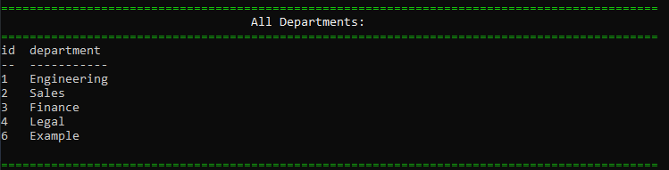

# _Employee Tracker_
> A simple app that lets you manage an employe database with only a series of steps in the command line.

## Table of Contents
* [Technologies Used](#technologies-used)
* [NPM modules Used](#node-modules-used)
* [Features](#features)
* [Installation](#installation)
* [Screenshot](#screenshot)
* [Project Status](#project-status)
* [Room for Improvement](#room-for-improvement)

## Technologies Used
- Tech 1 - **JavaScript**
- Tech 2 - **Node.js**

## Node Modules Used: 
- **Inquirer**
- **Chalk**
- **Console.table**
- **figlet**
- **validator**

## Features
Ready Features:
1. **Allows the user to view all the departments in the database**

2. **Allows the user to view all the roles in the database**

3. **Allows the user to view all the employees in the database**

4. **Allow the user to view employees by their correspondent department**

5. **Allows the user to view total department budgets:**

6. **Allow the user to add a department to the database:**

7. **Allow the user to add roles to the database:**

8. **Allow the user to add employees to the database:**

9. **Allows the user to update employees role:**

10. **Allows the user to update employees manager:**

11. **Allows the user to delete departments in the database:**

12. **Allows the user to delete roles in the database:**

13. **Allows the user to delete employees in the database:**

## Installation
To use this project, Please use:

`npm install`

## Screenshot
### Employee-Tracker:

## Project Status
Project is: _in progress_

## Room for Improvement
Room for improvement:
- TBD

To do:
- Add a GUI
